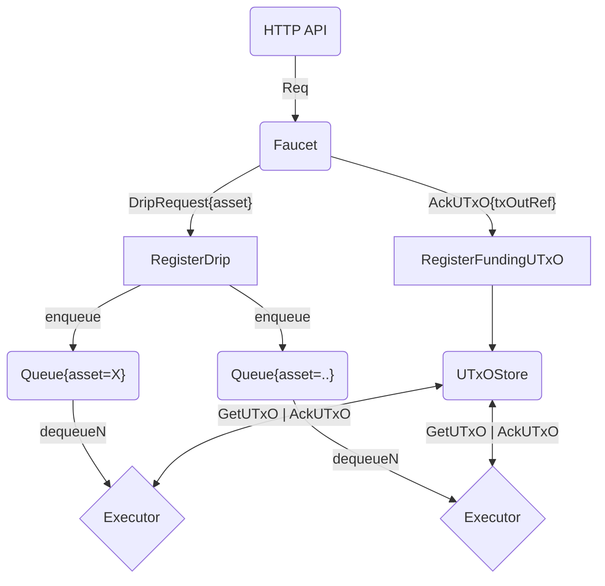

# cardano-faucet

## How to dockerize
- Copy executable binary to ./temp-build/ in project's root
- Specify configuration in ./config/config.dhall or mount on startup with ``` -v "${pwd}/config.dhall:/etc/cardano-faucet/config.dhall"```
- run docker build command.
- pull docker image on a machine and run 

## Architecture


